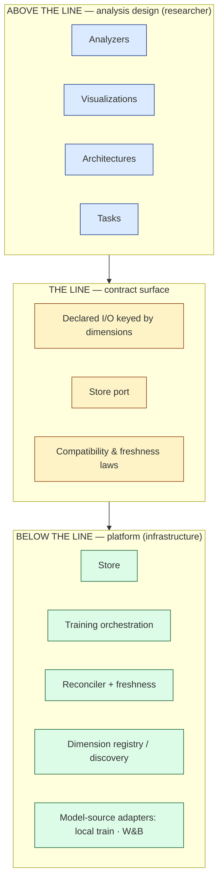

# MIScope — Platform Design (Clean-Room Baseline)

> **Status:** Proposed v1.0.0 clean-room baseline — 2026-07-07.
> Authored from settled concepts, implementation closed (design lifted, not
> reverse-engineered). Once ratified, this document is canonical and supersedes
> all pre-baseline requirements, which become historical and non-binding.

## What this platform is

MIScope is a **dynamics-analysis platform**: it standardizes and hones lenses on
models *as they learn*. It asks **how did learning happen** — not *did the model
learn the task*. Its power comes from one move: any analysis that can be run
against a final static model can be run against every checkpoint of a training
run, turning a static lens into a trajectory.

That move opens a further layer. Once a lens produces a *trajectory* rather than a
single point, the trajectory itself becomes an object of analysis — a class of
**dynamics-native** lenses that belong to the evolution, not to any single frozen
model. Dynamic Mode Decomposition (DMD) is the first of these: it reads the
sequence-over-training and extracts the modes of the learning process itself.
Static-per-checkpoint is the *enabler*; dynamics analysis is the *payoff*.

## The Line

The single organizing principle. Everything belongs on exactly one side of a
boundary — **the Line** — and the muddiness this baseline exists to remove was
the mixing of the two.

- **Below the Line — the Platform (infrastructure engineer owns).** The Store,
  training orchestration, the reconciler and freshness law, scalar↔tensor
  dispatch, the dimension registry and discovery, checkpoint identity. It
  *guarantees* materialization, freshness, storage, and discoverability.
- **Above the Line — Analysis design (researcher owns).** Designing Analyzers,
  adding Architectures, adding Tasks, adding Visualizations. This is where
  research decisions live — including *how densely to checkpoint through a
  transition* and *which derivations are worth storing*.
- **The Line itself — the contract surface.** The declarations a researcher
  fills in, expressed in dimensions, read and written only through the Store.
  This is the core infrastructure the platform was missing: not a layer of
  behavior, a seam.

**Litmus for placement:** *who owns this decision — the infrastructure engineer
or the researcher?* If a researcher owns it, it lives above the Line and the
platform's only job is to provide the contract that lets them express it.

## How it is meant to be used

A **researcher works entirely above the Line.** They design an Analyzer (declaring
its inputs and outputs, keyed by dimensions), register an Architecture (publishing
its hook surface and dimension vocabulary), define a Task (parameterized context),
or add a Visualization (a universal instrument over dimensions and facts). They
never compose a storage path, never learn the warehouse layout, never edit the
reconciler. The platform, below the Line, guarantees their declared work is
materialized, kept fresh, stored, and discoverable — **infrastructural guarantees,
scoped immediately below.**

## What the platform does not guarantee

The platform's guarantees are **infrastructural, not epistemic.** It guarantees the
data is materialized, fresh, stored, and discoverable — that the *instrument works
and the recording is sound as recorded*. It does **not** guarantee that claims
drawn from that data are valid. If a researcher checkpoints *sparsely* and then
asserts smooth dynamics that are in fact an artifact of undersampling the
transition, that is an analysis error, not a platform failure — epistemic validity
is an above-the-Line concern the researcher owns.

The platform may **surface affordances** — e.g. flagging that a trajectory is
sparse through the region being analyzed — the way a compiler emits warnings. But
warning is the ceiling; judgment stays with the researcher. Surfacing without
owning.

## The promotion path (exploratory → codified)

The platform supports research at every stage of maturity and makes *climbing* the
maturity ladder cheap. This is how the above-the-Line ecosystem grows, and it is a
core purpose of the platform — not an add-on.

- **Notebook → Analyzer.** Exploratory analysis begins in a notebook, against
  primitives and Store-mediated checkpoints. When it produces something worth
  keeping, promoting it to a declared **Analyzer** must be *low-friction* — mostly
  declaring outputs and wrapping the function. Once promoted, *every Family whose
  HookedModel satisfies its contract* can run it across all their Variants, and the
  platform materializes, refreshes, and surfaces the results for free.
- **Object → dimension.** When an object stabilizes (the community agrees the OV
  circuit is worth analyzing against), it is registered as a **dimension** — *by
  configuration, not a code change and Platform redeploy.* Configuration declares
  the dimension slot (identity, keying, maturity); an Analyzer populates its
  members; downstream facts may then be keyed against it.
- **Exploratory dimensions.** Dimensions carry a maturity status. A provisional
  object can be added as an **exploratory** dimension and used immediately, then
  graduated to canonical or retired — experimentation without polluting the
  canonical schema.

The platform provides the *ladder*; the researcher or community owns *when* to
climb it — the same surfacing-not-owning boundary that governs epistemic validity.

## Glossary

- **Architecture** — the model structure. Declares the *hook surface* and the
  *dimension vocabulary* analyzers key against, and governs the shape of weights
  and activations.
- **Task** — a **parameterized definition** (probe construction, interpretive
  basis, and metrics as *functions of declared parameters*) **plus a binding** of
  those parameters (e.g. `p = 113`). There is no separate "TaskType" object: the
  grouping "all modular-addition tasks" is a *query* over Tasks sharing a
  definition, not an entity (it fails the objecthood sieve).
- **Family** — the join of an Architecture with one or more bound Tasks. It is the
  **comparability class**: a natural grouping of models that can rightfully be
  compared. Families own no semantics of their own.
- **Variant** — a trained instance of a Family (Family + training configuration,
  including seeds). Analysis runs against a Variant.
- **Checkpoint** — a standalone model file exported during training. *Any analysis
  runnable against a final static model runs against each checkpoint.* A Variant
  produces an ordered checkpoint trajectory determined by its declared schedule.
- **HookedModel** — an instantiated, runnable model that *exposes* live
  activations through the hook surface its Architecture *declares*. The form an
  Analyzer operates on (a Checkpoint loaded into its Architecture).
- **Analyzer** — an object that runs analysis methods and declares its inputs
  (required features) and outputs (fields, dtype, kind, keying dimensions). Two
  classes by *data source*:
  - **Post-hoc Analyzer** — reads static Checkpoints (or upstream results) from the
    Store, after training. Re-runnable and idempotent; its outputs are *derived* and
    can be rematerialized anytime.
  - **In-Training Analyzer** — captures state that exists *only during the training
    loop* (actual gradients, optimizer state, per-step loss, update vectors). Binds
    to the training hook surface and runs inside orchestration; its outputs are
    *primary* — captured once, re-derivable only by re-running training. (Measures
    reconstructable from a static checkpoint — e.g. a gradient on a chosen probe —
    remain post-hoc; this class is for the genuinely ephemeral.)
- **Analyzer Primitive** — a standardized method that applies an analysis function
  to weights and activations (a HookedModel). Reused across analyzers; lives
  *outside* any single analyzer.
- **Store** — the total interface for reading and writing the platform's data:
  checkpoints, columnar facts, and tensor payload. Storage layout is internal to
  it; consumers never compose paths.
- **Visualization** — a codified, **universal instrument** (a standardized plot).
  Binds to dimensions and facts, never to an architecture or task. The *contract*
  lives in the Platform; *universal codified instances* (loss curve, eigenvalue
  spectrum) live in a shared Core Visualizations library; domain-specific plots
  live in the domain package.
- **Data View** — a compiled/queried view over the Store; a query-layer
  convenience. Distinct from a Visualization (the word previously conflated both).
- **Dimension** — an addressable entity that facts are keyed against. *A dimension
  member here may be a whole tensor, not a scalar label* — the signature inversion
  of this domain.
- **Fact** — a measurement produced by an analyzer, keyed against dimensions. The
  only non-dimension category.
- **Mathematically Defined Object** — a derived tensor **promoted to dimensionhood**
  through the admission sieve (a gauge-invariant function of the operand alone). It
  re-enters analysis as an *operand*. A terminal measurement, by contrast, is a
  Fact.

## Data model (summary — see `data_model.md`)

There are **dimension-providers** and **facts**. Three tiers provide dimensions,
differing only in *how they are admitted*:

1. **Infrastructure** — given by construction (Family, Variant, Checkpoint, Task,
   Analyzer, Architecture).
2. **Architecture** — given by the architecture (weights, activations; their shape
   *is* the dimension key).
3. **Mathematically Defined** — earned through the admission sieve (QK/OV circuit,
   Fourier basis).

**Facts** are the only non-dimension category. The vocabulary is Kimball
(dimensions / facts / star / snowflake), with two inversions stated so BI
intuition is not over-applied:

- **Unnamed dimensions.** Model tensors carry *unlabeled* axes; naming them *is the
  research*. Dimensions split into named (epoch, variant, layer, head — imposed by
  us) and latent (the tensor's internal axes under study).
- **Facts are measurements, not events.** A fact is *computed* by running an
  analyzer (grain: analyzer × checkpoint × dimensions), reproducible, not observed.

These unify one act: **producing a Mathematically Defined Object is promoting a
tensor to a dimension.** The admission sieve is the promotion gate. The
scalar↔tensor duality in the Store *is* the named↔unnamed dimension boundary.

## The three constraints, restated as projections of the Line

1. **Visualizations are universal instruments** — authored above the Line, keyed on
   dimensions, never owned by a family.
2. **Tasks provide context** — the *only* semantics that cross the Line arrive
   through the Task contract; Families and Architectures own none.
3. **Storage is internal to the API** — the Line is the Store port.

They are not three rules; they are one boundary written three times.

## Laws (enforced at the Line)

- **Compatibility law.** A HookedModel↔Analyzer pairing is validated at *bind
  time*: the platform rejects any pairing whose Analyzer requires features absent
  from the Architecture's published surface — before a forward pass, not with a
  runtime crash. This is what makes "universal instrument" a *checked* claim.
- **Freshness law.** Every materialized artifact carries a provenance signature
  computed from *all* its inputs — analyzer version, upstream fields, sites,
  configuration, **and the declared checkpoint schedule**. The reconciler
  rematerializes iff the signature changes. Silent staleness is a contract
  violation, not a bug to be rediscovered.
- **Storage encapsulation.** Everything reaches data through the Store; only the
  Store composes paths.

## External model sources (W&B) — provisional

> **Provisional — pending hands-on use.** The stance below is a working position,
> not settled design; it will be revised once W&B has been used for this case.

The motivating use is **searching the seed space** (model seed × data seed) for
models that exhibit a *measurable* signature — e.g. early vs late grokking, bumps in
second descent (a transient-frequency signature), or rebounds from second descent.
W&B is treated as a **below-the-Line model-source adapter**, used to *find models
for study, not optimized models*. Two invariants preserve single-source-of-truth
across a sweep:

- **One trainer.** Sweeps drive the single training orchestration with varied
  parameters (seeds); they never introduce a second training path.
- **One analyzer.** A sweep's objective *is* an existing analyzer's declared fact
  (the measured signature) — bound, not rewritten.

W&B's contribution narrows to *seed/parameter-space search + run tracking*: sweep
the space, score each trial with an analyzer, surface trials that reproduce the
signature; **select by the measured signature and checkpoint coverage of the
transition, not by final performance** — the inversion of W&B's normal use.
*Caveat:* dense-through-the-transition checkpoints can be guaranteed only for runs
the platform orchestrates.
