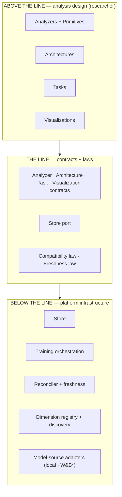
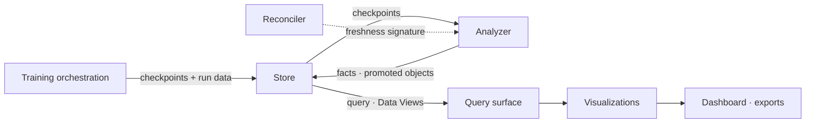
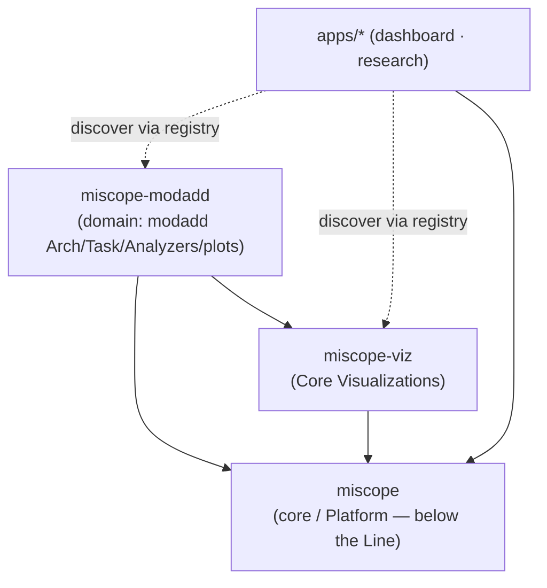
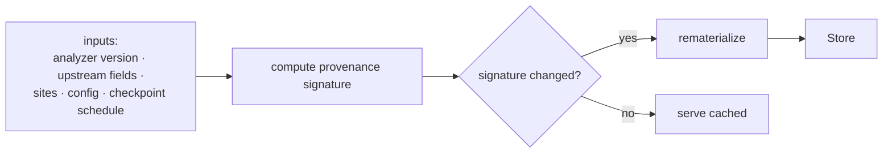

# MIScope — Architecture (Clean-Room Baseline)

> **Status:** Proposed v1.0.0 clean-room baseline — 2026-07-07. Companion to
> `PLATFORM.md` and `data_model.md`. Defines the system structure, the package
> boundaries, and the subsystems that earn a deep-dive.

## System view

`*` W&B adapter is provisional (see `PLATFORM.md`).

## Below-the-Line subsystems

- **Store** — the total read/write port for checkpoints, columnar facts, and tensor
  payload. Path composition is internal to it; nothing else composes paths.
- **Training orchestration** — runs training per the researcher's declared schedule,
  writing checkpoints and run metadata to the Store *during* the run.
- **Reconciler + freshness** — materializes facts and objects, and keeps them fresh
  via the provenance signature. Owns analyzer DAG ordering.
- **Dimension registry + discovery** — config-driven registration of dimensions
  (slot: identity, keying, maturity); answers "do we already have this, and at what
  maturity?" (discoverability-first).
- **Model-source adapters** — supply Variants (config + checkpoint trajectory + run
  facts) into the platform. Local training and W&B import are two implementations of
  one contract.

## The Line — contracts and laws

Four researcher-facing contracts cross the Line — **Analyzer** (declared inputs +
outputs keyed by dimensions), **Architecture** (published hook surface + dimension
vocabulary), **Task** (parameterized context: probe, basis, metrics), and
**Visualization** (universal instrument over dimensions/facts) — plus the **Store
port**. Two laws are enforced here:

- **Compatibility law** — a HookedModel↔Analyzer pairing is validated at bind time;
  an Analyzer requiring features absent from the Architecture's surface is refused
  before a forward pass.
- **Freshness law** — every materialized artifact carries a provenance signature
  over *all* its inputs; the reconciler rematerializes iff it changes.

## Data flow

## Packages & dependencies

The Platform/analysis split is realized as package boundaries. The **import graph is
the audit**: any path from a domain package into a core *internal* (rather than a
published contract) is a Line violation made visible.

- **`miscope`** (core / Platform) — contracts, Store, orchestration, reconciler +
  laws, dimension registry, typed Visualization bases. **Depends on nothing above
  the Line.**
- **`miscope-modadd`** (domain) — the modular-addition Architecture, Task, Analyzers,
  domain plots. A pure consumer of core; the reference package a newcomer gets for
  free to study and extend.
- **`miscope-viz`** (Core Visualizations) — universal codified plots. Depends on core
  only.

Packages **register** their Analyzers/Architectures/Tasks/Visualizations with the
registry; apps (dashboard, research notebooks) **discover** rather than hardcode, so
a newly installed package "shows up for free." Exploratory work lives in
`apps/research/notebooks`; promoting a cell means moving it *up* into a domain
package as a declared Analyzer (see the promotion path in `PLATFORM.md`).

## Subsystem deep-dives

### Store

The total data port. Reads/writes three kinds of data — **checkpoints** (model
weights), **columnar facts** (named-dimension measurements), **tensor payload**
(unnamed-axis tensors, addressed by reference). It fronts checkpoint access so that
consumers never load a checkpoint by path — closing the last reach-around. Storage
layout, scalar↔tensor dispatch, and path composition are internal; consumers use
accessors, and a missing accessor is filled in, never bypassed.

### Reconciler + freshness law

The materialization engine. Its correctness rests on one invariant: **the provenance
signature must cover every input that can change the output.** Past staleness bugs
were incomplete signatures, not logic errors.

### Training orchestration

Produces Variants and their checkpoint trajectories. The **schedule** is a
researcher-declared policy (above the Line — "density D through window W"); the
orchestration *enforces* it (below the Line) and emits the checkpoint set. Because
the checkpoint set is a function of that schedule, **the schedule is part of the
provenance signature** — changing density re-triggers materialization. Checkpoint
identity is content-derived, not mtime-derived.

Orchestration also exposes a **training hook surface** (gradients, optimizer state,
per-step loss, updates) and invokes registered **In-Training Analyzers** during the
run, writing their outputs to the Store as **primary artifacts** — alongside
checkpoints, and like checkpoints *not* re-derivable from the Store (the reconciler
treats them as inputs to the DAG, not products of it). These captures can run at
*step* grain, finer than the checkpoint schedule — a gradient norm is a scalar,
cheap to record densely even where full checkpoints are sparse.

## Visualization architecture

Three tiers, mirroring the packages:

- **Contract + typed bases** live in core. A `TimeSeries` base declares it is keyed
  on the epoch dimension.
- **Universal codified instances** (loss curve, eigenvalue spectrum) live in
  `miscope-viz`.
- **Domain plots** live in the domain package.

Interaction is **dimension-driven, not per-plot**: a visualization declares its
dimensions; the dashboard provides the epoch marker and selector *generically* for
anything keyed on the epoch dimension. Codify the affordance once, trigger it from
the declared dimension — every current and future time-series plot inherits it
without redesign.

## Model-source adapters (W&B — provisional)

See `PLATFORM.md`. W&B is a below-the-Line adapter for *finding models for study*:
sweep the seed space, score each trial with an existing analyzer, surface the models
that show the target signature. Provisional pending hands-on use.
