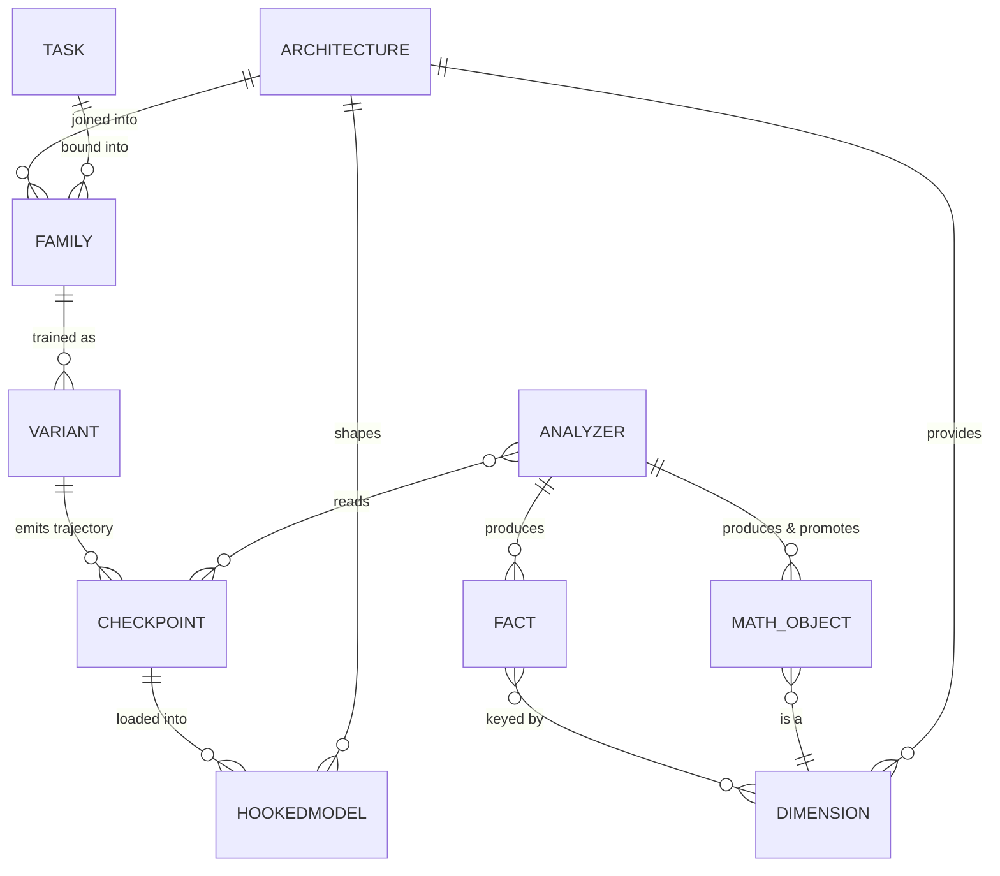
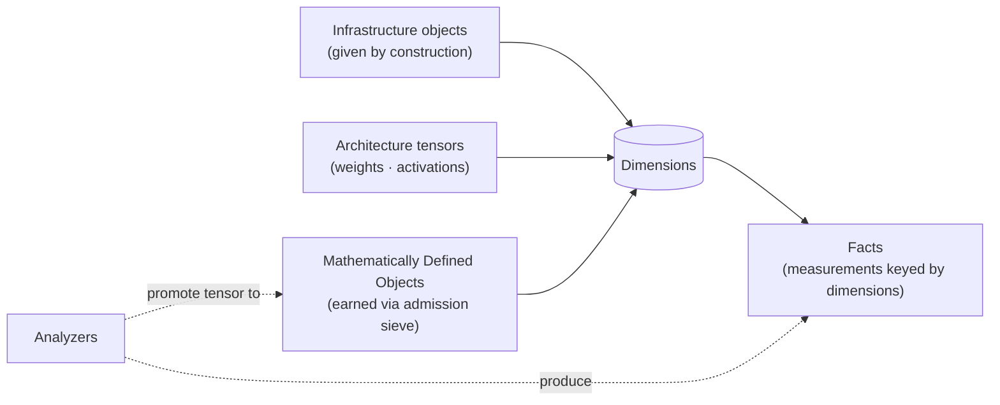

# MIScope — Data Model (Clean-Room Baseline)

> **Status:** Proposed v1.0.0 clean-room baseline — 2026-07-07. Companion to
> `PLATFORM.md`. Vocabulary is Kimball (dimensions / facts / star / snowflake),
> annotated where this domain inverts BI intuition.

## Two categories

There are exactly two kinds of thing in the data model:

- **Dimension-providers** — the addressable entities that facts are *keyed
  against*.
- **Facts** — measurements produced by analyzers, keyed against dimensions. The
  only non-dimension category.

The earlier "four sibling categories" framing was a mistake: Architecture objects
and Mathematically Defined objects are not siblings of dimensions — **they *are*
dimensions.** They differ from Infrastructure dimensions only in *how they are
admitted*.

## The three admission tiers of dimensions

| Tier | Admitted by | Examples |
|------|-------------|----------|
| **Infrastructure** | given by construction | Family, Variant, Checkpoint, Task, Analyzer, Architecture |
| **Architecture** | given by the architecture (shape is the key) | weights, activations |
| **Mathematically Defined** | earned through the admission sieve | QK/OV circuit, Fourier basis |

The **admission sieve**: promotion to objecthood requires the object be a
*gauge-invariant function of the operand alone*. What passes is a dimension you can
key facts against and re-analyze; what fails is a query result — a Fact.

## Two inversions (why plain Kimball stretches)

1. **Unnamed dimensions.** A BI dimension member is a scalar label (`2024-01-01`).
   Here a dimension member may be a **whole tensor** whose internal axes are
   *unlabeled* — and naming those axes *is the research*. Dimensions split into
   **named** (epoch, variant, layer, head — imposed by us) and **latent** (the
   tensor's internal axes under study). Mechanistic interpretability, in
   data-model terms, is the project of naming latent dimensions.
2. **Facts are measurements, not events.** A BI fact is an observed transaction;
   ours is *computed* by running an analyzer. Grain = analyzer × checkpoint ×
   dimensions. Reproducible, not observed.

## The unifying act

**Producing a Mathematically Defined Object is promoting a tensor to a dimension.**
The admission sieve is the promotion gate. This is the same boundary as the Store's
scalar↔tensor split:

- **Columnar facts** = axes fully named (queryable, join-able).
- **Tensor payload** = unnamed internal axes, stored by *reference* until an
  analyzer names some of them and projects them into columnar facts.

An analyzer's deepest job is often exactly this conversion: unnamed tensor axes →
named dimensions.

## Object vs Fact — the boundary test

A derived result that **re-enters analysis as an operand** (you run further analysis
on it) is a **Mathematically Defined Object**. A **terminal measurement** is a
**Fact**. This is why the Analyzer contract lists "upstream analysis results" as an
input: those re-entrant results are exactly the promoted objects.

## Dimension maturity

Dimensions carry a **maturity status** (see the promotion path in `PLATFORM.md`):

- **canonical** — community-settled; part of the stable schema.
- **exploratory** — provisional; usable immediately, graduated or retired later,
  without polluting the canonical schema.

A dimension is added by **configuration, not a code change and Platform redeploy.**
Configuration declares the **slot** (identity, keying, maturity); an **Analyzer
populates** its members. Two halves, cleanly split.

## Entity relations

`HOOKEDMODEL` = a `CHECKPOINT` loaded into its `ARCHITECTURE`; an `ANALYZER` may
also read upstream `FACT`s and `MATH_OBJECT`s (not just checkpoints).

## Dimension-providers → facts

## Kimball mapping notes

- **Star** is the default: facts reference dimensions directly.
- **Snowflake** appears only where a dimension is normalized into sub-dimensions
  (e.g. Family → Architecture, Task). Use it where the normalization is real, not
  by reflex.
- Storage layout implementing this model is **internal to the Store** (see
  `PLATFORM.md`, storage encapsulation). This document defines the *model*, not its
  on-disk form.
